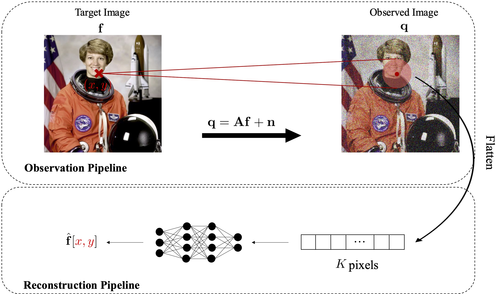

# LoFi: Neural Local Fields for Scalable Image Reconstruction

[](https://arxiv.org/abs/2411.04995)
[](https://paperswithcode.com/paper/lofi-scalable-local-image-reconstruction-with)
[](https://colab.research.google.com/drive/1gDVtX6LmV8fo1AnvZHm-HGgQ6cXfXAEY?usp=sharing)

This repository is the official Pytorch implementation of "LoFi: Neural Local Fields for Scalable Image Reconstruction". 

[Colab demo](https://colab.research.google.com/drive/1gDVtX6LmV8fo1AnvZHm-HGgQ6cXfXAEY?usp=sharing)


<p float="center">

</p>


## Requirements
(This code is tested with PyTorch 1.12.1, Python 3.8.3, CUDA 11.6 and cuDNN 7.)
- numpy
- scipy
- matplotlib
- imageio
- torch==1.12.1
- torchvision=0.13.1

## Installation

Run the following code to install conda environment "LoFi.yml":
```sh
conda env create -f LoFi.yml
```

## Dataset
All datasets have been uploaded to SwitchDrive.  The datasets can be downloaded using the following commands:

LDCT dataset:
```sh
curl -O -J https://drive.switch.ch/index.php/s/z9iqtogRJhdoGS0/download
```

Galaxies dataset:
```sh
curl -O -J https://drive.switch.ch/index.php/s/J93jxcl7qxjMwmH/download
```

ten-pic dataset:
```sh
curl -O -J https://drive.switch.ch/index.php/s/jnxhJ0ztAX1QHvK/download
```

After downloading the datasets, please put them in datasets directory in the main LoFi folder.

## Experiments
### Training & Inference
All arguments for training are explained in 'config.py'. After specifying your arguments, you can run the following command to train the model:
```sh
python3 train.py 
```


## Citation
If you find the code useful in your research, please consider citing the paper.

```
@article{khorashadizadeh2024lofi,
  title={Lofi: Neural local fields for scalable image reconstruction},
  author={Khorashadizadeh, AmirEhsan and Liaudat, Tob{\i}as I and Liu, Tianlin and McEwen, Jason D and Dokmanic, Ivan},
  journal={arXiv preprint arXiv},
  volume={2411},
  year={2024}
}
```

